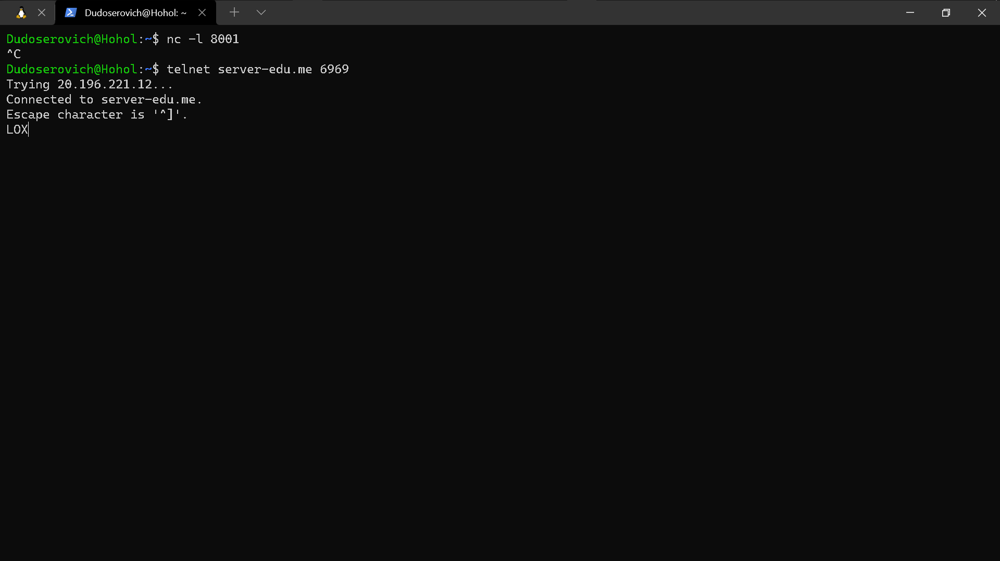

# Лабораторная работа №6 (Screen of Communications)
**Постановка задачи:** 
> Подключиться к серверу по SSH, выполнить ряд команд сетевого администрирования

## Общение через nc

## Общение через wget

## Общение через curl

## Произошёл скам на telnet без возможности выйти

## Общение через telnet

## Скачивание через wget

## Отправка запросов с помощью curl

